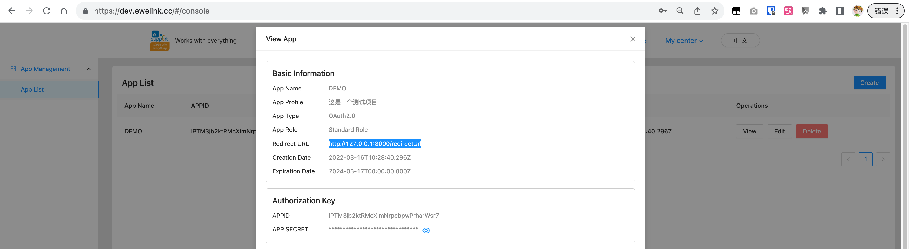

1. Modifying Configuration Files config.js

You should go https://dev.ewelink.cc/ Register an account, then create an application, obtain your own APP ID and APP Secret, and fill them in config.js.


2. Installation dependencies

```
npm i
```

3. Run the project:

```
npm run start
```

4. Log in to your own account:

```
Login URL: http://127.0.0.1:8000/login
```

5. control Devices Example:

```
node controlDeviceDemo.js
```
