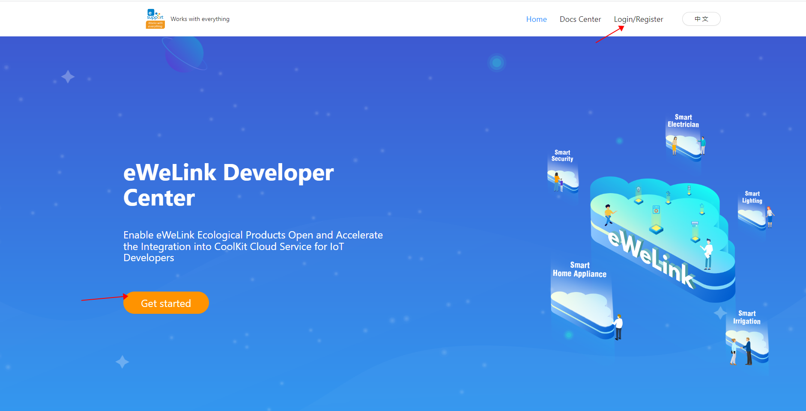
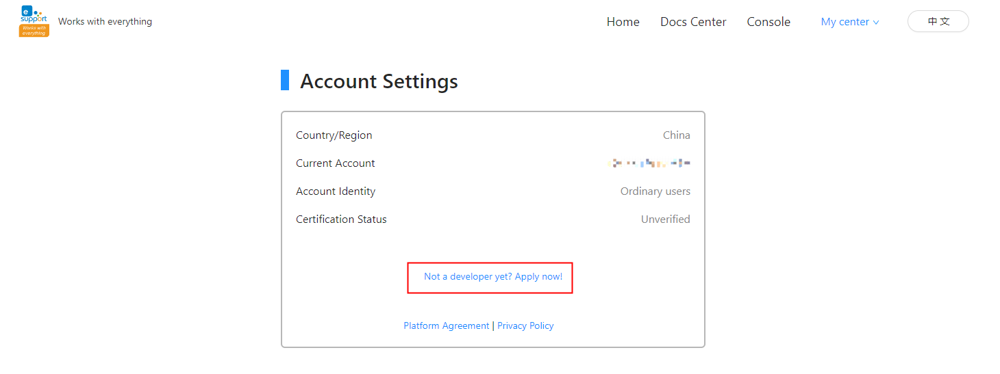
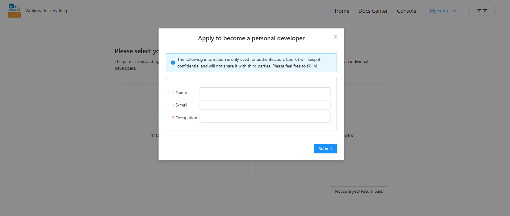
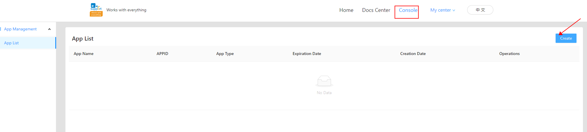
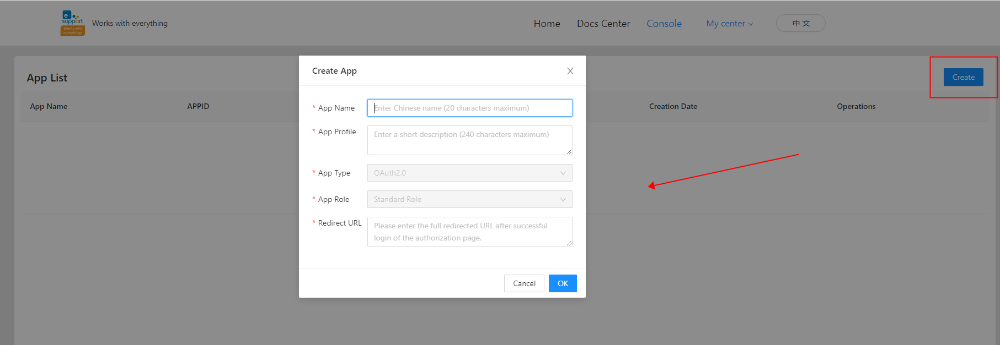
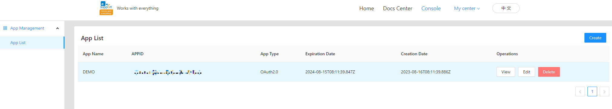

## eWelink Developer Platform Application to Become a Developer and Create Application Tutorials

### 1. Login/Register

Vist https://dev.ewelink.cc/ you need to login/register for an eWelink account to access the eWelink Developer Platform. You can click 'Get started' or 'Login/Register' button on the page, if you don't have an eWelink account click Create account to register and login, if you have an existing eWelink account enter your account password to login.



### 2. Apply for Developer Portal

After logging in successfully, you will go to My center page and click 'Apply now' to apply as a developer.



### 3. Fill in the application information

Select your account type as Individual Developers or Enterprise Developers. According to the type of choice to fill out the corresponding form information to submit, thought the individual developers form, after submission you will receive the audit results within 1-2 working days by e-mail, at the same time you can also in the eWelink developer platform to view the certification status of the developer application.



### 4. Creating an Application

After authentication you can create your App on the Console page by clicking the 'Create' button in the upper right corner.

If you want to test this project, the Redirect URL needs to be filled in as: http://127.0.0.1:8000/redirectUrl



### 5. Fill in the application configuration

Click the 'Create' button and follow the page prompts to configure your APP information, fill in and click OK to save.



### 6. APP List

After the APP application is saved successfully, APP List will appear the page as shown in the figure Create APP application is complete, you can see the information about the application you created, and it also supports viewing, editing, and deleting the application operation.



## Usage of this project

### 1. Modifying Configuration Files config.js

You should go https://dev.ewelink.cc/ Register an account, then create an application, obtain your own APP ID and APP Secret, and fill them in config.js.


### 2. Installation dependencies

```
npm i
```

### 3. Run the project:

```
npm run start
```

### 4. Log in to your own account:

```
Login URL: http://127.0.0.1:8000/login
```

### 5. control Devices Example:

```
node controlDeviceDemo.js
```
